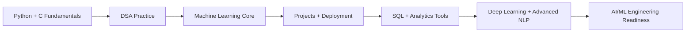

<div align="center">


<br><br>


<br><br>


</div>

---

## System Profile

```yaml
name: Tejas C
education:
  degree: B.E. / B.Tech in Computer Science Engineering
  university: Dayananda Sagar University
  year: 2nd Year
location: Bangalore, India
career_tracks:
  - AI/ML Engineer
  - Data Scientist
  - AI Developer
  - Software Engineering Intern
current_stage: Beginner-to-intermediate transition in ML and DSA
learning_style: Project-driven, step-by-step, foundation-first
```

---

## Mission

I am building toward an AI/ML engineering career by strengthening the layers that matter most: problem solving, machine learning fundamentals, project execution, SQL, and consistent practice. I like learning in a practical way, where each concept becomes a project, each project becomes experience, and each bug becomes part of the training.

<div align="center">
  
</div>

---

## Engineering Dashboard

<table>
  <tr>
    <td width="50%">

### Current Strengths

- Python and C
- DSA practice in Python and C
- Data cleaning and EDA
- Classification and regression workflows
- NLP basics with classical ML
- Streamlit deployment basics

    </td>
    <td width="50%">

### Active Growth Areas

- PostgreSQL and SQL confidence
- Power BI and Excel depth
- Deep Learning fundamentals
- Advanced NLP workflows
- LLM understanding
- More project polish and deployment maturity

    </td>
  </tr>
</table>

---

## Tech Landscape

<div align="center">


<br><br>


<br><br>


<br><br>


</div>

---

## What I Can Build With

```text
Programming Layer
  Python, C, Git, GitHub, problem solving

Data Layer
  Cleaning, EDA, train-test split, feature preprocessing, scaling

ML Layer
  Classification, regression, model training, evaluation workflows

NLP Layer
  Text cleaning, tokenization, stopword removal, Bag of Words, TF-IDF,
  Logistic Regression, Naive Bayes

Deployment Layer
  Basic joblib + Streamlit model deployment workflow
```

---

## Project Grid

| Project | Focus | What It Shows |
|---|---|---|
| Loan Approval Prediction System | Classification | End-to-end preprocessing, model comparison, and Streamlit deployment |
| House Price Prediction System | Regression | EDA, feature understanding, and predictive modeling |
| Heart Disease Prediction System | Classification | Health-data based modeling and evaluation thinking |
| Student Performance Prediction System | Prediction Workflow | Academic performance analysis using ML |
| Customer Churn Prediction System | Business ML | Retention-focused prediction and classification logic |
| NLP Emotion Detection Project | Classical NLP | Text preprocessing, BoW, TF-IDF, and ML-based text classification |

<div align="center">
  
</div>

---

## DSA Track

I have solved **50+ DSA / LeetCode-style problems** and practiced core patterns in both **Python** and **C**.

---

## Learning Pipeline



---

## GitHub Signals

<div align="center">


<br><br>


<br><br>


<br><br>


</div>

---

## Professional Traits

- Self-learner with strong curiosity about AI and ML
- Comfortable improving from fundamentals rather than skipping steps
- Consistent project builder
- Patient with debugging and iteration
- Serious about long-term technical growth

---

## Connect

<div align="center">

<a href="https://github.com/Tejas-c-0">
  
</a>
<a href="https://www.linkedin.com/in/tejas-c-14b6a9375/">
  
</a>

</div>

---

## Long-Term Direction

My goal is not just to complete courses or build random projects. I want to become the kind of engineer who understands the fundamentals, builds reliable systems, and can grow from classical machine learning into deeper AI work with confidence.

<div align="center">

`Learning with intent. Building with discipline. Growing toward AI/ML engineering.`

</div>
